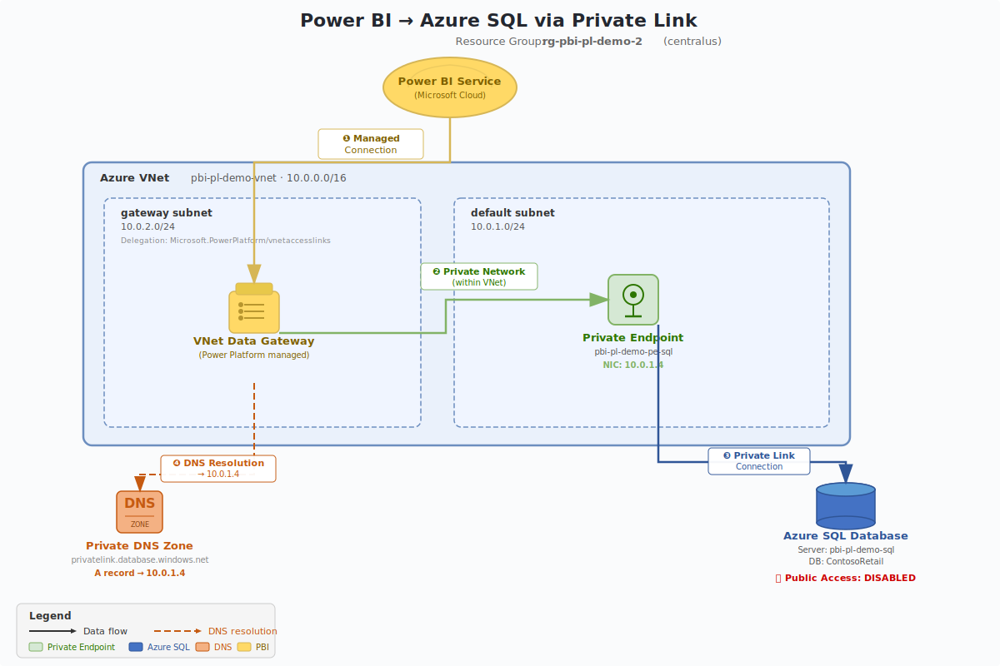

# Power BI + Azure SQL Private Link Demo

## Secure Private Connectivity — No Public Endpoint Exposure

[](https://opensource.org/licenses/MIT)

---

## Overview

This repository provides a **complete, end-to-end demo** proving that Power BI Service can access an Azure SQL Database entirely over private connectivity using Azure Private Link — with **no public endpoint exposure**.

The demo is **automation-first** (Bicep + Azure CLI) with parallel **portal click-paths** for manual walkthroughs.

---

## Architecture



> 📐 [Open editable draw.io diagram](https://app.diagrams.net/#Hdmauser%2Fpowerbi-sql-networking%2Fmaster%2Fdocs%2Fnetwork-diagram.drawio)

**Key security posture**: Azure SQL has public network access disabled. All traffic flows through the Private Endpoint. DNS resolves the SQL FQDN to a private IP via the Private DNS Zone.

### Setup

The deployment creates a single Azure VNet (`10.0.0.0/16`) with two subnets:

| Subnet | CIDR | Purpose |
|--------|------|---------|
| `default` | `10.0.1.0/24` | Hosts the **Private Endpoint** that provides a private NIC (e.g., `10.0.1.4`) mapped to the Azure SQL Server |
| `gateway` | `10.0.2.0/24` | Hosts the **VNet Data Gateway**, delegated to `Microsoft.PowerPlatform/vnetaccesslinks` so Power BI Service can inject the gateway into this subnet |

Azure SQL Server is created with **public network access disabled** — there are no firewall rules, no "Allow Azure services" exceptions. The only way to reach it is through the Private Endpoint.

A **Private DNS Zone** (`privatelink.database.windows.net`) is linked to the VNet and automatically registers an A record pointing the SQL Server's FQDN to the Private Endpoint's private IP address.

### Traffic Flow

When Power BI refreshes a dataset, the following happens end-to-end:

1. **Power BI Service → VNet Data Gateway** — Power BI Service initiates a managed connection to the VNet Data Gateway running inside the `gateway` subnet. This is a Microsoft-managed control plane connection — no inbound ports need to be opened.

2. **DNS Resolution** — The gateway resolves `pbi-pl-demo-sql-xxxxx.database.windows.net`. Because the VNet is linked to the Private DNS Zone, the query hits `privatelink.database.windows.net` and returns the private IP `10.0.1.4` instead of a public IP.

3. **VNet Data Gateway → Private Endpoint** — The gateway connects to `10.0.1.4:1433` over the VNet's private network. Traffic stays within the Azure backbone — it never traverses the public internet.

4. **Private Endpoint → Azure SQL** — The Private Endpoint forwards the TDS connection to the Azure SQL Server over Microsoft's Private Link infrastructure. SQL Server sees the connection as coming from the Private Endpoint's NIC.

5. **Response** — Query results travel the reverse path back to Power BI Service, which updates the dataset and any connected reports/dashboards.

> **Key point**: At no stage does traffic leave the private network. DNS resolves to a private IP, the gateway connects over the VNet, and the Private Endpoint tunnels into SQL — all within the Azure backbone.

---

## Prerequisites

- **Azure**: Active subscription with Contributor access
- **Tools**: [Azure CLI](https://aka.ms/installazurecliwindows) installed, logged in (`az login`)
- **Power BI**: Pro or Premium workspace, admin permissions to create VNet Data Gateways
- **Optional**: [Bicep CLI](https://learn.microsoft.com/azure/azure-resource-manager/bicep/install) (bundled with Azure CLI)

---

## Quick Start

### 1. Deploy Infrastructure (Automated)

```powershell
# Edit parameters
code parameters/demo.bicepparam

# Deploy
az group create --name rg-pbi-pl-demo --location eastus
az deployment group create \
  --resource-group rg-pbi-pl-demo \
  --template-file main.bicep \
  --parameters parameters/demo.bicepparam
```

Or use the guided script:

```powershell
.\scripts\azure\01-deploy-infrastructure.ps1
```

### 2. Seed Sample Data

```powershell
.\scripts\azure\04-seed-sql-data.ps1
```

> This script temporarily enables public access on the SQL server, seeds the ContosoRetail database with sample data (schema + rows + verification), then re-disables public access and removes the firewall rule.

### 3. Configure Power BI (Manual Steps)

These steps cannot be automated with Bicep:

1. **Create VNet Data Gateway** — Power BI Service → Settings → Manage gateways → Create VNet data gateway → select the `gateway` subnet
2. **Add data source** — Gateway settings → Add data source → Azure SQL → use private FQDN
3. **Publish report** — Power BI Desktop → connect to SQL → build report → Publish
4. **Refresh dataset** — Power BI Service → Dataset settings → Gateway connection → Refresh now

### 4. Validate

```powershell
.\scripts\azure\03-validate-deployment.ps1
```

### 5. Cleanup

```powershell
.\scripts\azure\99-cleanup.ps1
```

---

## Repository Structure

```
main.bicep                          # Bicep orchestrator
modules/
  vnet.bicep                        # VNet + subnets
  sql.bicep                         # Azure SQL Server + Database
  privateEndpoint.bicep             # Private Endpoint for SQL
  privateDns.bicep                  # Private DNS zone + VNet link
parameters/
  demo.bicepparam                   # Parameter file (edit before deploy)
scripts/
  azure/
    01-deploy-infrastructure.ps1    # Deploy Bicep
    02-configure-sql-network.ps1    # Verify/lock SQL networking
    03-validate-deployment.ps1      # Post-deploy validation
    04-seed-sql-data.ps1            # Seed SQL data (temp opens public access)
    99-cleanup.ps1                  # Tear down everything
  sql/
    01-create-schema.sql            # Create tables
    02-insert-sample-data.sql       # Seed Contoso Retail data
    03-verify-data.sql              # Verify data integrity
docs/
  architecture.md                   # Detailed architecture + flows
  demo-runbook.md                   # 10-15 min timed demo script
  portal-walkthrough.md             # Portal click-paths (mirrors automation)
  troubleshooting.md                # Top 8 failure modes + fixes
```

---

## Documentation

| Guide | Purpose |
|-------|---------|
| [Architecture](docs/architecture.md) | Component details, network flows, DNS resolution, security posture |
| [Demo Runbook](docs/demo-runbook.md) | Timed script with talk track, show/tell cues, checkpoints |
| [Portal Walkthrough](docs/portal-walkthrough.md) | Step-by-step Azure Portal + Power BI Service instructions |
| [Troubleshooting](docs/troubleshooting.md) | Symptom → Cause → Fix for common failures |

---

## Sample Data

The demo uses a **Contoso Retail** dataset:

| Table | Rows | Purpose |
|-------|------|---------|
| Customers | 15 | Customer demographics (10 US states) |
| Products | 10 | 4 categories: Electronics, Clothing, Home & Garden, Sports |
| Orders | 25 | Orders spanning 6 months with varied statuses |
| OrderItems | 50 | Line items with computed totals |

---

## Cost

This demo uses minimal Azure resources:

- **SQL Database**: Basic tier (~$5/month)
- **VNet + Private Endpoint**: Minimal cost (~$7.50/month for PE)
- **Private DNS Zone**: ~$0.50/month
- **VNet Data Gateway**: No Azure infrastructure cost (runs in Fabric capacity)

**Estimated total**: ~$13/month. Delete the resource group when done to stop charges.

---

## License

MIT — see [LICENSE](LICENSE) for details.
